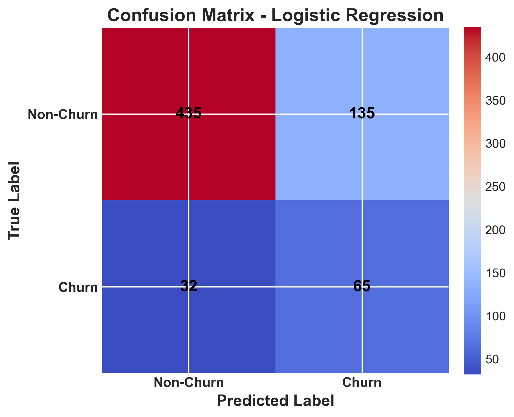

# Telecom-Churn Prediction
## A Machine Learning Study to Identify Customers at Risk of Leaving


**Author:** [Vilmarson JULES](mailto:vilmarsonjules22@gmail.com)

## Project Overview
---

This project focuses on predicting customer churn for a telecom company, DIGICEL Haiti for example, a leading telecommunications provider. The goal is to build a machine learning classification model that identifies customers at high risk of leaving the company’s services. 

By leveraging historical customer data, including usage patterns, service plans, and billing information, the project aims to uncover patterns that indicate churn.

## Business Problem
---

 

The comapany is losing a significant number of customers to competitors, resulting in reduced revenue and higher acquisition costs. The company currently lacks a reliable way to identify at-risk customers proactively, making it challenging to implement targeted retention strategies before churn occurs.

As a Data Scientist and Machine Learning Specialist at DIGICEL, I am tasked with developing a predictive model that can accurately identify customers at high risk of churn. By providing these insights, I will enable DIGICEL’s marketing and retention teams to take targeted actions to reduce churn.

## The Data
---

The dataset for this project is publicly available on Kaggle: [Churn in Telecoms Dataset](https://www.kaggle.com/datasets/becksddf/churn-in-telecoms-dataset)
. It is provided in CSV format (inside a ZIP file) and contains customer account details, usage patterns, and service plans for a telecommunications company.
This dataset will be used throughout Phase 3 to explore, preprocess, and model customer churn, forming the basis for all analyses and predictions in the project.

## Methods
---
In this project, we adopt a predictive modeling approach focused on classification, leveraging historical customer data to identify those at risk of churn. The goal is to build robust machine learning models that provide actionable insights, enabling targeted retention strategies and data-driven business decisions.

This project follows a predictive modeling approach to classify customers at risk of churn. The main steps are:

- **Data Preprocessing :** Prepare and clean the data for modeling.
- **Predictive Model Performance :** Develop and tune classification models to predict churn.
- **Model Evaluation :** Assess model performance using key metrics and compare results.

## Business Understanding
---


This project aims to predict customer churn for a telecommunications company. Accurately identifying at-risk customers allows the company to implement targeted retention strategies, optimize marketing efforts, and reduce revenue loss. By analyzing customer behavior and service usage, the project provides actionable insights to retain customers and maximize their lifetime value.

## Predictive Model Performance
---
Evaluate the performance of predictive models designed to identify customers at risk of churn, highlighting key metrics, visualizations, and actionable insights that guide targeted retention strategies and optimize resource allocation.

- **Logistic Regression** – Baseline model for interpreting feature influence.

- **Decision Tree (Vanilla)** – Simple tree capturing basic non-linear patterns.

- **Optimized Decision Tree** – Tuned tree with improved accuracy and AUC for deeper insights.

For each model, we provide the confusion matrix, evaluation metrics (accuracy, precision, recall, F1-score, AUC), ROC curves, and interpretations that connect model performance to actionable business decisions.

### Logistic Regression - Model Performnace

The model accurately identifies the majority of loyal customers (TN = 435), minimizing unnecessary retention efforts and marketing spend. It also flags a significant portion of at-risk customers (TP = 65), enabling targeted interventions such as personalized offers or loyalty rewards. While a few loyal clients may be incorrectly flagged (FP = 135), this trade-off is reasonable compared to the cost of losing actual churners.



The model achieves 75% overall accuracy, correctly predicting most customers. It identifies 67% of actual churners, though only about one-third of predicted churners actually leave, reflecting a moderate balance between precision and recall (F1-score 0.44). For non-churners, performance is strong, with high precision (0.93) and solid recall (0.76), ensuring loyal customers are rarely misclassified.

The model achieves an AUC of 0.80, showing strong ability to distinguish churners from non-churners. This means a randomly selected churner is correctly ranked above a non-churner 80% of the time. The ROC curve confirms performance well above random guessing, highlighting reliable predictive power.


In practice, this enables the company to prioritize at-risk customers and allocate retention resources—such as personalized offers, loyalty programs, or discounts—more efficiently. While not perfect, the model provides a valuable decision-support tool for reducing churn and protecting revenue.

### Baseline Decision Tree - Model Performnace

The model is highly reliable at identifying loyal customers (TN = 538), ensuring DIGICEL avoids overspending on unnecessary retention campaigns. It also captures a solid share of actual churners (TP = 66), enabling proactive retention actions such as loyalty programs or targeted discounts. However, some churners are still missed (FN = 31), which represents lost opportunities to intervene, while a small number of false positives (FP = 32) may lead to minor extra costs.

The model helps prioritize resources toward customers most likely to leave, protecting revenue from churn while keeping retention efforts efficient and focused.


The baseline Decision Tree delivers 91% accuracy, with strong precision and recall for loyal customers (0.95 and 0.94). This allows DIGICEL to minimize wasted retention efforts. For churners, it identifies about 68% of actual cases, giving the company a reliable signal to act on most at-risk clients. Overall, the model balances efficiency and effectiveness, making it a valuable tool for targeted retention strategies.


The model effectively identifies loyal customers with high precision (0.95) and recall (0.94), minimizing wasted retention efforts. For customers likely to churn, it captures 68% of actual churners, ensuring that most at-risk clients are flagged for proactive actions. With 91% overall accuracy and an AUC of 0.81, the model provides Digicel a practical tool to focus retention resources efficiently and reduce potential revenue loss.


The model enables the company to prioritize retention efforts efficiently, focusing resources on customers most likely to churn while minimizing unnecessary interventions for loyal clients. By accurately flagging at-risk customers, the company can implement targeted offers, loyalty programs, and proactive communication, reducing potential revenue loss and improving overall customer satisfaction.

### Optimized Decision Tree - Model Performnace

The optimized tree performs well at identifying loyal customers (TN = 495) and captures many churners (TP = 62), though some are still missed (FN = 35). False positives (75) mean some loyal customers receive unnecessary retention offers, slightly increasing costs.

Despite trade-offs, the model provides actionable insights by flagging many at-risk customers. This allows Digicel to launch proactive retention measures, where the cost of a few extra offers is outweighed by the benefit of preventing customer loss.


The model achieves 84% overall accuracy. It captures 64% of churners (recall) but with modest precision (45%), while performing strongly on non-churners (precision 93%, recall 87%).
This balance makes it valuable for retention: many at-risk customers are identified for proactive actions, and although some loyal clients may be flagged, the trade-off is acceptable compared to losing true churners.

This model achieves an AUC of 0.82, slightly outperforming logistic regression (0.80). This indicates reliable discrimination between churners and non-churners, though some trade-offs remain with missed churners and false positives.


Its strong predictive power and interpretability make it a valuable tool for Digicel’s retention strategy, enabling prioritization of at-risk customers. The small edge over logistic regression suggests it may be the preferred model when balancing accuracy with business-friendly insights.


## Business Recommendations
---

### 1. Implement Proactive Retention Programs  

- **Target High-Risk Customers:**  
Use the predictive model to identify churn-prone customers and act early with personalized offers, loyalty incentives, or enhanced support. This ensures resources are invested where they have the greatest impact.  

- **Avoid Unnecessary Interventions:**  
Focus retention efforts only where needed, reducing costs and preventing over-contact with loyal customers. This data-driven approach improves efficiency while maintaining strong customer satisfaction.  

### 2. Prioritize High-Value Customers  

- **Focus on Profitability:**  
Combine churn predictions with customer lifetime value (CLV) to identify which at-risk customers are most valuable.  

- **Return on Retention Investments :**  
Direct retention efforts toward these customers to ensure budgets deliver the strongest financial impact, while using lighter strategies for lower-value accounts.  

### 3. Enhance Service and Marketing Strategies  

- **Leverage Insights from Model Patterns:**  
The model highlights key churn drivers (e.g., service plans, usage behaviors, tenure). These insights guide product and service adjustments tailored to at-risk segments.  

- **Personalized Marketing Campaigns:**  
Use churn patterns to design targeted campaigns, promotions, and upselling strategies that directly address churn risks, increasing engagement and retention.  

### 4. Continuously Monitor and Improve the Predictive Model  


- **Integrate Model in Operations:**  
Deploy the churn model into daily workflows to flag at-risk customers in real time, enabling timely and proactive retention actions.  

- **Regularly Update and Validate:**  
Monitor metrics like AUC, precision, and recall to ensure ongoing accuracy. Retrain the model with fresh data as customer behavior and market conditions evolve.  

## Conclusion
---

This predictive analysis offers actionable insights into customer churn for the telecommunications sector, helping retain high-value clients and mitigate revenue loss.

**Key findings include:**

- **Non-churners are reliably identified:** Models show strong accuracy in recognizing loyal customers, allowing retention resources to focus on those who truly need intervention.

- **Targeted strategies are essential for churners:** While a portion of churners is accurately captured, some are missed, emphasizing the importance of data-driven, focused retention efforts.

- **Baseline Decision Tree is effective:** The untuned model performed well, sometimes outperforming the optimized version, indicating that simpler models can be sufficient and avoid unnecessary complexity.

- **Predictive insights enable proactive actions:** Leveraging these models supports personalized retention programs, loyalty incentives, and strategic engagement to maximize customer lifetime value and reduce potential churn-related revenue losses.

Overall, combining predictive modeling with targeted retention initiatives empowers the company to make informed, data-driven decisions that safeguard revenue and strengthen customer loyalty.

## Next Steps
---
​
- **Continuously monitor churn patterns :** Track customer behavior and engagement metrics regularly to detect early signs of churn and validate predictive model performance.
​
- **Refine predictive models :** Update and retrain models with new data, exploring additional features or alternative algorithms to improve accuracy and recall for identifying at-risk customers.
​
- **Implement targeted retention strategies :** Use model predictions to design personalized retention programs, loyalty incentives, or proactive outreach campaigns focused on the most at-risk segments.
​
- **Evaluate business impact :** Measure the effectiveness of retention initiatives by tracking churn reduction, revenue retention, and ROI, adjusting strategies based on observed outcomes.
​
- **Integrate predictive insights into CRM systems :** Embed churn scores and risk categories into operational systems to guide sales, support, and marketing teams in real-time decision-making.


## Full Analysis & Contact
---
Explore the complete analytical workflow in the [Jupyter Notebook](./churn_index.ipynb) or review the [presentation slides](./ChurnInsight_Presentation.pdf) for a high-level summary key findings and actionable recommendations.

For professional inquiries, collaboration opportunities, or discussions about the methodology and insights, reach out to:

**Vilmarson JULES**  
Data Science & AI Student  
📧 [vilmarsonjules22@gmail.com](mailto:vilmarsonjules22@gmail.com)  


## Repository Structure

```
ds-3-telecom-churn-prediction/
│
├── Data/
├── Images/
├── README.md
├── churn_index.ipynb
├── ChurnInsight_Presentation.pdf 

```

